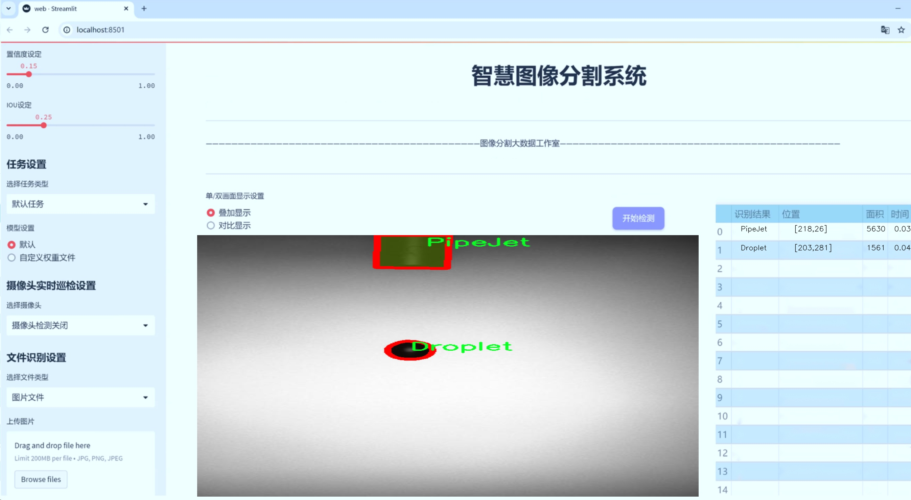
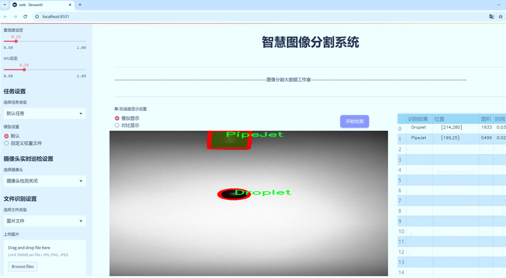
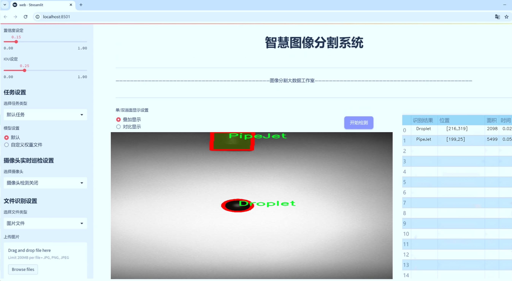
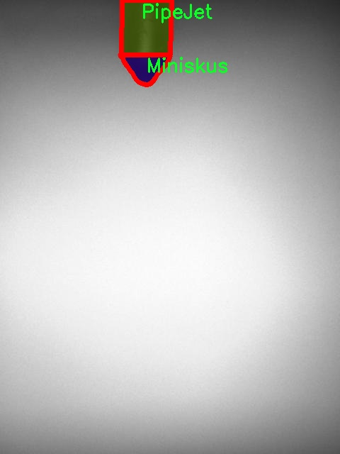
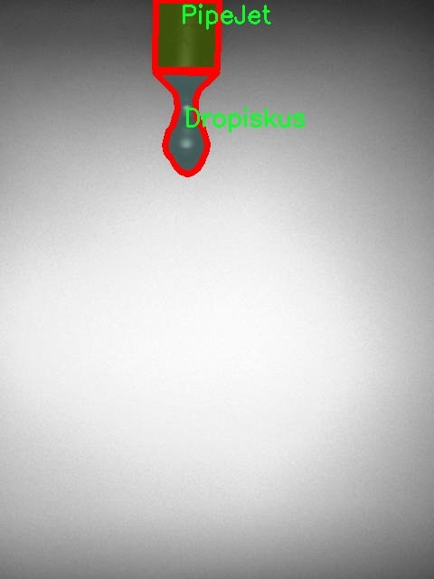
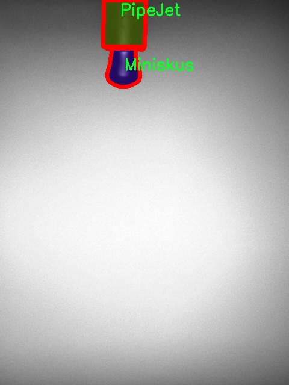
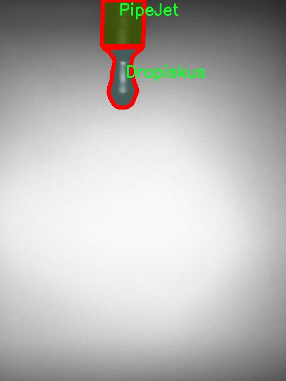

# 液滴图像分割系统源码＆数据集分享
 [yolov8-seg-p2＆yolov8-seg-p6等50+全套改进创新点发刊_一键训练教程_Web前端展示]

### 1.研究背景与意义

项目参考[ILSVRC ImageNet Large Scale Visual Recognition Challenge](https://gitee.com/YOLOv8_YOLOv11_Segmentation_Studio/projects)

项目来源[AAAI Global Al lnnovation Contest](https://kdocs.cn/l/cszuIiCKVNis)

研究背景与意义

随着计算机视觉技术的快速发展，图像分割作为其中的重要任务之一，已经在多个领域得到了广泛应用，包括医学影像分析、自动驾驶、农业监测等。液滴图像分割，作为一种特定的图像分割任务，旨在从复杂背景中准确提取液滴的形状和位置，具有重要的应用价值。例如，在化学反应和生物实验中，液滴的分布和形态直接影响实验结果的准确性和可靠性。因此，开发高效的液滴图像分割系统，不仅能够提升实验的自动化程度，还能为科学研究提供更为精确的数据支持。

近年来，YOLO（You Only Look Once）系列模型因其出色的实时目标检测能力而受到广泛关注。YOLOv8作为该系列的最新版本，进一步提升了检测精度和速度，尤其在复杂场景下的表现更为优异。然而，针对液滴图像的分割任务，传统的YOLOv8模型在处理细小、形状各异的液滴时，仍然面临一定的挑战。为了克服这些挑战，基于改进YOLOv8的液滴图像分割系统的研究显得尤为重要。

本研究所使用的数据集包含2000幅图像，涵盖了五类液滴对象：Dropiskus、Droplet、Miniskus、PipeJet和Satellit。这些类别的多样性为模型的训练提供了丰富的样本，有助于提高分割的鲁棒性和准确性。通过对这些液滴的特征进行深入分析，我们可以更好地理解不同液滴在图像中的表现，从而为模型的改进提供理论依据。此外，数据集中液滴的多样性和复杂性，能够有效地推动模型在不同场景下的适应能力，提升其在实际应用中的可行性。

在研究意义方面，基于改进YOLOv8的液滴图像分割系统，不仅有助于推动计算机视觉领域的技术进步，还能够为液滴相关的科学研究提供强有力的工具支持。通过高效的图像分割，我们能够更精确地获取液滴的形状、大小和分布信息，从而为后续的实验分析提供数据基础。此外，该系统的成功应用还将为其他类似的图像分割任务提供借鉴，促进不同领域之间的技术交流与合作。

综上所述，基于改进YOLOv8的液滴图像分割系统的研究，不仅具有重要的理论价值，还具有广泛的实际应用前景。通过深入探讨液滴图像的特征及其分割方法，我们期望能够为相关领域的研究提供新的思路和方法，推动科学技术的进步与发展。

### 2.图片演示







##### 注意：由于此博客编辑较早，上面“2.图片演示”和“3.视频演示”展示的系统图片或者视频可能为老版本，新版本在老版本的基础上升级如下：（实际效果以升级的新版本为准）

  （1）适配了YOLOV8的“目标检测”模型和“实例分割”模型，通过加载相应的权重（.pt）文件即可自适应加载模型。

  （2）支持“图片识别”、“视频识别”、“摄像头实时识别”三种识别模式。

  （3）支持“图片识别”、“视频识别”、“摄像头实时识别”三种识别结果保存导出，解决手动导出（容易卡顿出现爆内存）存在的问题，识别完自动保存结果并导出到tempDir中。

  （4）支持Web前端系统中的标题、背景图等自定义修改，后面提供修改教程。

  另外本项目提供训练的数据集和训练教程,暂不提供权重文件（best.pt）,需要您按照教程进行训练后实现图片演示和Web前端界面演示的效果。

### 3.视频演示

[3.1 视频演示](https://www.bilibili.com/video/BV11tC2YpEHH/)

### 4.数据集信息展示

##### 4.1 本项目数据集详细数据（类别数＆类别名）

nc: 5
names: ['Dropiskus', 'Droplet', 'Miniskus', 'PipeJet', 'Satellit']


##### 4.2 本项目数据集信息介绍

数据集信息展示

在本研究中，我们使用了名为“resampling-1956”的数据集，以训练和改进YOLOv8-seg液滴图像分割系统。该数据集专注于液滴图像的精确分割，包含了多种液滴形态和特征，旨在为计算机视觉领域提供丰富的训练样本，从而提升模型在液滴检测和分割任务中的性能。

“resampling-1956”数据集包含五个主要类别，分别是：Dropiskus、Droplet、Miniskus、PipeJet和Satellit。这些类别代表了不同类型的液滴形态，具有各自独特的物理特征和视觉表现。具体而言，Dropiskus类别主要指的是呈现出特殊形状的液滴，通常在流体动力学实验中观察到；Droplet则是指一般的液滴形态，具有较为常见的圆形或近似圆形的外观；Miniskus类别则涉及到小型液滴，通常在微流体设备中出现；PipeJet类别则代表了在管道流动中形成的液滴，具有较强的流动性和动态特征；最后，Satellit类别则描述了在特定条件下形成的卫星液滴，通常与主液滴有一定的空间关系。

该数据集的设计考虑到了液滴在不同环境和条件下的表现，确保了样本的多样性和代表性。通过对液滴的不同形态进行标注，研究人员能够更好地理解液滴的形成机制及其在流体动力学中的行为。这种多样性不仅提高了模型的泛化能力，也为后续的研究提供了坚实的基础。

在数据集的构建过程中，研究团队采用了高精度的图像采集技术，确保了图像的清晰度和细节表现。每个类别的样本数量经过精心平衡，以避免模型在训练过程中出现偏差。此外，数据集还包括了不同光照条件、背景干扰和液滴大小变化等多种因素的样本，使得模型能够在各种实际应用场景中表现出色。

通过使用“resampling-1956”数据集，YOLOv8-seg模型能够学习到液滴的复杂特征，从而实现更高效的分割和检测。该数据集不仅为模型提供了丰富的训练样本，还为研究人员在液滴图像处理领域的探索提供了重要的参考依据。未来，我们期望通过对该数据集的深入分析和应用，推动液滴图像分割技术的发展，并为相关领域的研究提供新的思路和方法。

总之，“resampling-1956”数据集在液滴图像分割系统的训练中发挥了至关重要的作用，其丰富的类别和多样的样本为模型的性能提升奠定了基础。随着研究的深入，我们相信该数据集将为液滴图像处理技术的进步做出更大的贡献。










### 5.全套项目环境部署视频教程（零基础手把手教学）

[5.1 环境部署教程链接（零基础手把手教学）](https://www.bilibili.com/video/BV1jG4Ve4E9t/?vd_source=bc9aec86d164b67a7004b996143742dc)


[5.2 安装Python虚拟环境创建和依赖库安装视频教程链接（零基础手把手教学）](https://www.bilibili.com/video/BV1nA4VeYEze/?vd_source=bc9aec86d164b67a7004b996143742dc)

### 6.手把手YOLOV8-seg训练视频教程（零基础小白有手就能学会）

[6.1 手把手YOLOV8-seg训练视频教程（零基础小白有手就能学会）](https://www.bilibili.com/video/BV1cA4VeYETe/?vd_source=bc9aec86d164b67a7004b996143742dc)


按照上面的训练视频教程链接加载项目提供的数据集，运行train.py即可开始训练



     Epoch   gpu_mem       box       obj       cls    labels  img_size
     1/200     0G   0.01576   0.01955  0.007536        22      1280: 100%|██████████| 849/849 [14:42<00:00,  1.04s/it]
               Class     Images     Labels          P          R     mAP@.5 mAP@.5:.95: 100%|██████████| 213/213 [01:14<00:00,  2.87it/s]
                 all       3395      17314      0.994      0.957      0.0957      0.0843

     Epoch   gpu_mem       box       obj       cls    labels  img_size
     2/200     0G   0.01578   0.01923  0.007006        22      1280: 100%|██████████| 849/849 [14:44<00:00,  1.04s/it]
               Class     Images     Labels          P          R     mAP@.5 mAP@.5:.95: 100%|██████████| 213/213 [01:12<00:00,  2.95it/s]
                 all       3395      17314      0.996      0.956      0.0957      0.0845

     Epoch   gpu_mem       box       obj       cls    labels  img_size
     3/200     0G   0.01561    0.0191  0.006895        27      1280: 100%|██████████| 849/849 [10:56<00:00,  1.29it/s]
               Class     Images     Labels          P          R     mAP@.5 mAP@.5:.95: 100%|███████   | 187/213 [00:52<00:00,  4.04it/s]
                 all       3395      17314      0.996      0.957      0.0957      0.0845


### 7.50+种全套YOLOV8-seg创新点代码加载调参视频教程（一键加载写好的改进模型的配置文件）

[7.1 50+种全套YOLOV8-seg创新点代码加载调参视频教程（一键加载写好的改进模型的配置文件）](https://www.bilibili.com/video/BV1Hw4VePEXv/?vd_source=bc9aec86d164b67a7004b996143742dc)

### 8.YOLOV8-seg图像分割算法原理

原始YOLOv8-seg算法原理

YOLOv8-seg算法是2023年由Ultralytics公司推出的YOLO系列中的最新版本，旨在进一步提升目标检测和分割的精度与效率。该算法在YOLOv7的基础上进行了深度优化，采用了更为复杂和高效的卷积神经网络结构，结合了多种先进的技术手段，使其在处理各种视觉任务时表现出色。YOLOv8-seg不仅可以进行目标检测，还具备强大的图像分割能力，适用于智能监控、自动驾驶、医学影像分析等多个领域。

YOLOv8-seg的网络结构主要分为三个部分：Backbone、Neck和Head。Backbone部分负责特征提取，采用了一系列卷积和反卷积层，利用残差连接和瓶颈结构来优化网络的性能。特别是，YOLOv8-seg引入了C2f模块，替代了YOLOv5中的C3模块，这一变化显著提高了特征提取的效率。C2f模块通过分离卷积和连接操作，能够更好地捕捉图像中的细节信息，从而提升模型的整体表现。

在Backbone部分，YOLOv8-seg使用了CSP（Cross Stage Partial）结构，将特征提取过程分为两个部分，这种设计不仅减小了模型的计算复杂度，还增强了特征的表达能力。最后，Backbone部分通过快速空间金字塔池化（SPPF）模块进一步提升了模型的计算速度，使得YOLOv8-seg在处理高分辨率图像时依然能够保持良好的实时性。

Neck部分则采用了PAN-FPN（Path Aggregation Network - Feature Pyramid Network）结构，这一结构通过多尺度特征融合技术，将来自Backbone不同阶段的特征图进行有效整合。这种融合方式使得模型能够更好地捕捉不同尺度目标的信息，提升了目标检测的性能和鲁棒性。在YOLOv8-seg中，Neck部分的设计不仅增强了特征的多样性，还为后续的目标分类和分割任务提供了更加丰富的上下文信息。

在Head部分，YOLOv8-seg负责最终的目标检测和分割任务。该部分设有多个检测头，能够在不同尺寸的信息下进行目标检测。每个检测头包含一系列卷积层和反卷积层，通过解耦头结构来生成检测结果。这种设计使得YOLOv8-seg在处理复杂场景时，能够更准确地识别和分割目标物体。此外，YOLOv8-seg还采用了Anchor-Free的检测方式，避免了传统方法中对锚框的依赖，从而简化了模型的训练过程，并提高了检测精度。

YOLOv8-seg在损失函数的设计上也进行了创新，采用了CloU（Class-aware Localization Uncertainty）损失函数，这一损失函数通过考虑类别信息来优化目标的定位精度，使得模型在处理不同类别的目标时，能够更好地平衡精度与召回率。这样的设计不仅提升了目标检测的性能，还为图像分割任务提供了更为准确的边界信息。

值得一提的是，YOLOv8-seg在训练和部署过程中引入了新的PyTorch框架，使得自定义模型的训练变得更加便捷。用户可以根据自己的需求，灵活调整网络结构和参数设置，从而实现更为个性化的应用。这一特性使得YOLOv8-seg在实际应用中具备了更高的适应性和可扩展性。

总的来说，YOLOv8-seg算法通过对网络结构的深度优化和新技术的引入，显著提升了目标检测和分割的性能。其在精度和速度上的双重优势，使得YOLOv8-seg成为当前视觉任务中的一项重要工具。无论是在智能监控、自动驾驶还是医学影像分析等领域，YOLOv8-seg都展现出了强大的应用潜力。通过对YOLOv8-seg的深入研究与应用，未来的计算机视觉技术将会迎来更加广阔的发展前景。


### 9.系统功能展示（检测对象为举例，实际内容以本项目数据集为准）

图9.1.系统支持检测结果表格显示

  图9.2.系统支持置信度和IOU阈值手动调节

  图9.3.系统支持自定义加载权重文件best.pt(需要你通过步骤5中训练获得)

  图9.4.系统支持摄像头实时识别

  图9.5.系统支持图片识别

  图9.6.系统支持视频识别

  图9.7.系统支持识别结果文件自动保存

  图9.8.系统支持Excel导出检测结果数据


### 10.50+种全套YOLOV8-seg创新点原理讲解（非科班也可以轻松写刊发刊，V11版本正在科研待更新）

#### 10.1 由于篇幅限制，每个创新点的具体原理讲解就不一一展开，具体见下列网址中的创新点对应子项目的技术原理博客网址【Blog】：


[10.1 50+种全套YOLOV8-seg创新点原理讲解链接](https://gitee.com/qunmasj/good)

#### 10.2 部分改进模块原理讲解(完整的改进原理见上图和技术博客链接)【如果此小节的图加载失败可以通过CSDN或者Github搜索该博客的标题访问原始博客，原始博客图片显示正常】

### YOLOv8简介
YOLOv8是一种目标检测模型，是基于YOLO (You Only Look Once)系列算法发展而来的最新版本。它的核心思想是将目标检测任务转化为一个回归问题，通过单次前向传播即可直接预测出图像中的多个目标的位置和类别。
YOLOv8的网络结构采用了Darknet作为其主干网络，主要由卷积层和池化层构成。与之前的版本相比，YOLOv8在网络结构上进行了改进，引入了更多的卷积层和残差模块，以提高模型的准确性和鲁棒性。
YOLOv8采用了一种特征金字塔网络(Feature Pyramid Network,FPN)的结构，通过在不同层级上融合多尺度的特征信息，可以对不同尺度的目标进行有效的检测。此外，YOLOv8还引入了一种自适应感知域(Adaptive Anchors
的机制，通过自适应地学习目标的尺度和
长宽比，提高了模型对于不同尺度和形状目标的检测效果。
总体来说，YOLOv8结构模型综合了多个先进的目标检测技术，在保证检测速度的同时提升了检测精度和鲁棒性，被广泛应用于实时目标检测任务中。


#### yolov8网络模型结构图

YOLOv8 (You Only Look Once version 8)是一种目标检测算法，它在实时场景下可以快速准确地检测图像中的目标。
YOLOv8的网络模型结构基于Darknet框架，由一系列卷积层、池化层和全连接层组成。主要包含以下几个组件:
1.输入层:接收输入图像。
2.卷积层:使用不同尺寸的卷积核来提取图像特征。
3.残差块(Residual blocks):通过使用跳跃连接(skip connections）来解决梯度消失问题，使得网络更容易训练。
4.上采样层(Upsample layers):通过插值操作将特征图的尺寸放大，以便在不同尺度上进行目标检测。
5.池化层:用于减小特征图的尺寸，同时保留重要的特征。
6.1x1卷积层:用于降低通道数，减少网络参数量。
7.3x3卷积层:用于进—步提取和组合特征。
8.全连接层:用于最后的目标分类和定位。
YOLOv8的网络结构采用了多个不同尺度的特征图来检测不同大小的目标，从而提高了目标检测的准确性和多尺度性能。
请注意，YOLOv8网络模型结构图的具体细节可能因YOLO版本和实现方式而有所不同。


#### yolov8模型结构
YOLOv8模型是一种目标检测模型，其结构是基于YOLOv3模型进行改进的。模型结构可以分为主干网络和检测头两个部分。
主干网络是一种由Darknet-53构成的卷积神经网络。Darknet-53是一个经过多层卷积和残差连接构建起来的深度神经网络。它能够提取图像的特征信息，并将这些信息传递给检测头。
检测头是YOLOv8的关键部分，它负责在图像中定位和识别目标。检测头由一系列卷积层和全连接层组成。在每个检测头中，会生成一组锚框，并针对每个锚框预测目标的类别和位置信息。
YOLOv8模型使用了预训练的权重，其中在COCO数据集上进行了训练。这意味着该模型已经通过大规模数据集的学习，具有一定的目标检测能力。

### RT-DETR骨干网络HGNetv2简介
#### RT-DETR横空出世
前几天被百度的RT-DETR刷屏，参考该博客提出的目标检测新范式对原始DETR的网络结构进行了调整和优化，以提高计算速度和减小模型大小。这包括使用更轻量级的基础网络和调整Transformer结构。并且，摒弃了nms处理的detr结构与传统的物体检测方法相比，不仅训练是端到端的，检测也能端到端，这意味着整个网络在训练过程中一起进行优化，推理过程不需要昂贵的后处理代价，这有助于提高模型的泛化能力和性能。


当然，人们对RT-DETR之所以产生浓厚的兴趣，我觉得大概率还是对YOLO系列审美疲劳了，就算是出到了YOLO10086，我还是只想用YOLOv5和YOLOv7的框架来魔改做业务。。

#### 初识HGNet
看到RT-DETR的性能指标，发现指标最好的两个模型backbone都是用的HGNetv2，毫无疑问，和当时的picodet一样，骨干都是使用百度自家的网络。初识HGNet的时候，当时是参加了第四届百度网盘图像处理大赛，文档图像方向识别专题赛道，简单来说，就是使用分类网络对一些文档截图或者图片进行方向角度分类。


当时的方案并没有那么快定型，通常是打榜过程发现哪个网络性能好就使用哪个网络做魔改，而且木有显卡，只能蹭Ai Studio的平台，不过v100一天8小时的实验时间有点短，这也注定了大模型用不了。 

流水的模型，铁打的炼丹人，最后发现HGNet-tiny各方面指标都很符合我们的预期，后面就一直围绕它魔改。当然，比赛打榜是目的，学习才是享受过程，当时看到效果还可以，便开始折腾起了HGNet的网络架构，我们可以看到，PP-HGNet 针对 GPU 设备，对目前 GPU 友好的网络做了分析和归纳，尽可能多的使用 3x3 标准卷积（计算密度最高），PP-HGNet是由多个HG-Block组成，细节如下：


ConvBNAct是啥？简单聊一聊，就是Conv+BN+Act，CV Man应该最熟悉不过了：
```python
class ConvBNAct(TheseusLayer):
    def __init__(self,
                 in_channels,
                 out_channels,
                 kernel_size,
                 stride,
                 groups=1,
                 use_act=True):
        super().__init__()
        self.use_act = use_act
        self.conv = Conv2D(
            in_channels,
            out_channels,
            kernel_size,
            stride,
            padding=(kernel_size - 1) // 2,
            groups=groups,
            bias_attr=False)
        self.bn = BatchNorm2D(
            out_channels,
            weight_attr=ParamAttr(regularizer=L2Decay(0.0)),
            bias_attr=ParamAttr(regularizer=L2Decay(0.0)))
        if self.use_act:
            self.act = ReLU()
 
    def forward(self, x):
        x = self.conv(x)
        x = self.bn(x)
        if self.use_act:
            x = self.act(x)
        return x 
```
且标准卷积的数量随层数深度增加而增多，从而得到一个有利于 GPU 推理的骨干网络，同样速度下，精度也超越其他 CNN ，性价比也优于ViT-base模型。


另外，我们可以看到：

PP-HGNet 的第一层由channel为96的Stem模块构成，目的是为了减少参数量和计算量。PP-HGNet

Tiny的整体结构由四个HG Stage构成，而每个HG Stage主要由包含大量标准卷积的HG Block构成。

PP-HGNet的第三到第五层使用了使用了可学习的下采样层（LDS Layer），该层group为输入通道数，可达到降参降计算量的作用，且Tiny模型仅包含三个LDS Layer，并不会对GPU的利用率造成较大影响.

PP-HGNet的激活函数为Relu，常数级操作可保证该模型在硬件上的推理速度。

### 11.项目核心源码讲解（再也不用担心看不懂代码逻辑）

#### 11.1 ultralytics\models\fastsam\val.py

以下是对代码的核心部分进行提炼和详细注释的结果：

```python
# 引入必要的模块
from ultralytics.models.yolo.segment import SegmentationValidator
from ultralytics.utils.metrics import SegmentMetrics

class FastSAMValidator(SegmentationValidator):
    """
    自定义验证类，用于快速SAM（Segment Anything Model）分割，基于Ultralytics YOLO框架。

    该类扩展了SegmentationValidator类，专门定制了快速SAM的验证过程。它将任务设置为'分割'，
    并使用SegmentMetrics进行评估。此外，为了避免在验证过程中出现错误，禁用了绘图功能。
    """

    def __init__(self, dataloader=None, save_dir=None, pbar=None, args=None, _callbacks=None):
        """
        初始化FastSAMValidator类，将任务设置为'分割'，并将指标设置为SegmentMetrics。

        参数：
            dataloader (torch.utils.data.DataLoader): 用于验证的数据加载器。
            save_dir (Path, optional): 保存结果的目录。
            pbar (tqdm.tqdm): 用于显示进度的进度条。
            args (SimpleNamespace): 验证器的配置。
            _callbacks (dict): 存储各种回调函数的字典。

        注意：
            在此类中禁用了ConfusionMatrix和其他相关指标的绘图，以避免错误。
        """
        # 调用父类的初始化方法
        super().__init__(dataloader, save_dir, pbar, args, _callbacks)
        
        # 设置任务类型为'分割'
        self.args.task = 'segment'
        
        # 禁用绘图功能，避免在验证过程中出现错误
        self.args.plots = False
        
        # 初始化指标对象，用于计算分割性能
        self.metrics = SegmentMetrics(save_dir=self.save_dir, on_plot=self.on_plot)
```

### 代码分析与注释说明：

1. **引入模块**：引入了`SegmentationValidator`和`SegmentMetrics`，这两个模块是进行分割验证和性能评估的核心。

2. **类定义**：`FastSAMValidator`类继承自`SegmentationValidator`，专门用于快速SAM的分割验证。

3. **构造函数**：
   - `__init__`方法用于初始化类的实例，接收多个参数以配置验证过程。
   - `super().__init__()`调用父类的构造函数，确保父类的初始化逻辑得以执行。
   - `self.args.task`设置为'分割'，表明当前任务的类型。
   - `self.args.plots`被设置为`False`，以禁用绘图功能，避免在验证过程中可能出现的错误。
   - `self.metrics`创建了一个`SegmentMetrics`实例，用于计算和存储分割的性能指标，结果将保存在指定的目录中。

以上是对代码的核心部分提炼和详细注释，希望能帮助理解其功能和结构。

这个文件定义了一个名为 `FastSAMValidator` 的类，继承自 `SegmentationValidator`，用于在 Ultralytics YOLO 框架中进行快速 SAM（Segment Anything Model）分割的自定义验证。该类主要用于处理分割任务，并利用 `SegmentMetrics` 进行评估。

在类的文档字符串中，描述了该类的主要功能和属性。`FastSAMValidator` 主要是为了定制化验证过程，特别是针对快速 SAM 的需求。它将任务类型设置为“分割”，并且禁用了绘图功能，以避免在验证过程中出现错误。

在初始化方法 `__init__` 中，接受多个参数，包括数据加载器 `dataloader`、结果保存目录 `save_dir`、进度条 `pbar`、其他自定义参数 `args` 以及回调函数 `_callbacks`。通过调用父类的初始化方法，设置了基本的验证环境。接着，将任务类型明确设置为“segment”，并将绘图功能禁用，以避免与混淆矩阵及其他相关指标的绘图功能产生冲突。最后，初始化了 `SegmentMetrics` 对象，用于后续的性能评估。

总体而言，这个文件的主要目的是为快速 SAM 分割模型提供一个专门的验证工具，确保在验证过程中能够有效地评估模型性能，同时避免不必要的错误。

#### 11.2 ui.py

```python
import sys
import subprocess

def run_script(script_path):
    """
    使用当前 Python 环境运行指定的脚本。

    Args:
        script_path (str): 要运行的脚本路径

    Returns:
        None
    """
    # 获取当前 Python 解释器的路径
    python_path = sys.executable

    # 构建运行命令
    command = f'"{python_path}" -m streamlit run "{script_path}"'

    # 执行命令
    result = subprocess.run(command, shell=True)
    if result.returncode != 0:
        print("脚本运行出错。")


# 实例化并运行应用
if __name__ == "__main__":
    # 指定您的脚本路径
    script_path = "web.py"  # 这里可以直接指定脚本路径

    # 运行脚本
    run_script(script_path)
```

### 代码注释说明：

1. **导入模块**：
   - `import sys`：导入 `sys` 模块，用于访问与 Python 解释器相关的变量和函数。
   - `import subprocess`：导入 `subprocess` 模块，用于创建新进程、连接到它们的输入/输出/错误管道，并获取它们的返回码。

2. **定义 `run_script` 函数**：
   - 该函数接收一个参数 `script_path`，表示要运行的 Python 脚本的路径。
   - 使用 `sys.executable` 获取当前 Python 解释器的路径，以确保使用正确的 Python 环境来运行脚本。
   - 构建命令字符串 `command`，该命令使用 `streamlit` 模块运行指定的脚本。
   - 使用 `subprocess.run` 执行构建的命令，并通过 `shell=True` 允许在 shell 中执行命令。
   - 检查命令的返回码，如果不为 0，表示脚本运行出错，打印错误信息。

3. **主程序入口**：
   - 使用 `if __name__ == "__main__":` 确保只有在直接运行该脚本时才会执行以下代码。
   - 指定要运行的脚本路径 `script_path`，在这里直接指定为 `"web.py"`。
   - 调用 `run_script` 函数，传入脚本路径以执行该脚本。

这个程序文件的主要功能是通过当前的 Python 环境来运行一个指定的脚本，具体是一个名为 `web.py` 的文件。首先，程序导入了必要的模块，包括 `sys`、`os` 和 `subprocess`，这些模块分别用于访问 Python 解释器的信息、操作系统功能以及执行外部命令。

在文件中定义了一个名为 `run_script` 的函数，该函数接受一个参数 `script_path`，表示要运行的脚本的路径。函数内部首先获取当前 Python 解释器的路径，并将其存储在 `python_path` 变量中。接着，构建一个命令字符串，使用 `streamlit` 模块来运行指定的脚本，这个命令将会在命令行中执行。

使用 `subprocess.run` 方法来执行构建好的命令，并通过 `shell=True` 参数在一个新的 shell 中运行这个命令。执行后，函数会检查返回的结果码，如果返回码不为零，表示脚本运行出错，程序会输出相应的错误信息。

在文件的最后部分，使用 `if __name__ == "__main__":` 语句来确保只有在直接运行该文件时才会执行下面的代码。这里指定了要运行的脚本路径 `web.py`，并调用 `run_script` 函数来执行这个脚本。

整体来看，这个程序的目的是为了方便地通过 Python 环境来启动一个基于 Streamlit 的 web 应用，简化了运行过程中的命令输入。

#### 11.3 ultralytics\hub\session.py

以下是代码中最核心的部分，并附上详细的中文注释：

```python
import signal
import sys
from pathlib import Path
from time import sleep
import requests
from ultralytics.hub.utils import HUB_API_ROOT, HUB_WEB_ROOT, smart_request
from ultralytics.utils import LOGGER, __version__, checks, is_colab
from ultralytics.utils.errors import HUBModelError

AGENT_NAME = f'python-{__version__}-colab' if is_colab() else f'python-{__version__}-local'

class HUBTrainingSession:
    """
    HUB训练会话类，用于Ultralytics HUB YOLO模型的训练管理，包括模型初始化、心跳监测和检查点上传。
    """

    def __init__(self, url):
        """
        初始化HUBTrainingSession，使用提供的模型标识符。

        参数:
            url (str): 用于初始化HUB训练会话的模型标识符，可以是URL字符串或特定格式的模型键。

        异常:
            ValueError: 如果提供的模型标识符无效。
            ConnectionError: 如果无法连接到全局API密钥。
        """
        from ultralytics.hub.auth import Auth

        # 解析输入的模型URL
        if url.startswith(f'{HUB_WEB_ROOT}/models/'):
            url = url.split(f'{HUB_WEB_ROOT}/models/')[-1]
        if [len(x) for x in url.split('_')] == [42, 20]:
            key, model_id = url.split('_')
        elif len(url) == 20:
            key, model_id = '', url
        else:
            raise HUBModelError(f"model='{url}' not found. Check format is correct.")

        # 授权
        auth = Auth(key)
        self.agent_id = None  # 识别与服务器通信的实例
        self.model_id = model_id
        self.model_url = f'{HUB_WEB_ROOT}/models/{model_id}'
        self.api_url = f'{HUB_API_ROOT}/v1/models/{model_id}'
        self.auth_header = auth.get_auth_header()
        self.rate_limits = {'metrics': 3.0, 'ckpt': 900.0, 'heartbeat': 300.0}  # API调用的速率限制（秒）
        self.metrics_queue = {}  # 模型的指标队列
        self.model = self._get_model()  # 获取模型数据
        self.alive = True  # 心跳循环是否活跃
        self._start_heartbeat()  # 启动心跳监测
        self._register_signal_handlers()  # 注册信号处理器
        LOGGER.info(f'查看模型在 {self.model_url} 🚀')

    def _get_model(self):
        """从Ultralytics HUB获取并返回模型数据。"""
        api_url = f'{HUB_API_ROOT}/v1/models/{self.model_id}'

        try:
            response = smart_request('get', api_url, headers=self.auth_header, thread=False, code=0)
            data = response.json().get('data', None)

            if data.get('status', None) == 'trained':
                raise ValueError('模型已训练并上传。')

            if not data.get('data', None):
                raise ValueError('数据集可能仍在处理，请稍后再试。')
            self.model_id = data['id']

            if data['status'] == 'new':  # 新模型开始训练
                self.train_args = {
                    'batch': data['batch_size'],
                    'epochs': data['epochs'],
                    'imgsz': data['imgsz'],
                    'patience': data['patience'],
                    'device': data['device'],
                    'cache': data['cache'],
                    'data': data['data']}
                self.model_file = data.get('cfg') or data.get('weights')
                self.model_file = checks.check_yolov5u_filename(self.model_file, verbose=False)
            elif data['status'] == 'training':  # 继续训练现有模型
                self.train_args = {'data': data['data'], 'resume': True}
                self.model_file = data['resume']

            return data
        except requests.exceptions.ConnectionError as e:
            raise ConnectionRefusedError('ERROR: HUB服务器未在线，请稍后再试。') from e
        except Exception:
            raise

    @threaded
    def _start_heartbeat(self):
        """开始一个线程心跳循环，向Ultralytics HUB报告代理的状态。"""
        while self.alive:
            r = smart_request('post',
                              f'{HUB_API_ROOT}/v1/agent/heartbeat/models/{self.model_id}',
                              json={'agent': AGENT_NAME, 'agentId': self.agent_id},
                              headers=self.auth_header,
                              retry=0,
                              code=5,
                              thread=False)  # 已在一个线程中
            self.agent_id = r.json().get('data', {}).get('agentId', None)
            sleep(self.rate_limits['heartbeat'])  # 根据速率限制等待
```

### 代码说明：
1. **导入模块**：导入必要的模块和库，包括信号处理、系统操作、路径处理、时间处理和HTTP请求等。
2. **AGENT_NAME**：根据运行环境（Colab或本地）设置代理名称。
3. **HUBTrainingSession类**：定义了一个用于管理Ultralytics HUB YOLO模型训练的类。
   - **初始化方法**：解析模型URL，进行授权，设置相关属性，并启动心跳监测。
   - **_get_model方法**：从Ultralytics HUB获取模型数据，处理不同状态的模型（新模型或正在训练的模型）。
   - **_start_heartbeat方法**：在一个线程中定期向Ultralytics HUB发送心跳信号，报告代理的状态。

这个程序文件定义了一个名为 `HUBTrainingSession` 的类，主要用于管理 Ultralytics HUB 上 YOLO 模型的训练会话。该类负责模型的初始化、心跳检测和检查点上传等功能。

在初始化方法 `__init__` 中，程序首先解析传入的模型标识符 `url`，如果该标识符是一个有效的模型 URL，程序会提取出模型的关键部分。接着，程序会进行身份验证，并设置一些重要的属性，如模型的 ID、模型的 URL、API 的 URL、身份验证头、速率限制、定时器、指标队列等。初始化完成后，程序会启动心跳检测，以定期向服务器报告状态，并注册信号处理程序，以便在接收到终止信号时能够优雅地退出。

`_register_signal_handlers` 方法用于注册信号处理程序，以处理系统的终止信号（如 SIGTERM 和 SIGINT）。当接收到这些信号时，`_handle_signal` 方法会被调用，停止心跳检测并退出程序。

`upload_metrics` 方法用于将模型的指标上传到 Ultralytics HUB。它会构建一个包含指标的有效负载，并通过 `smart_request` 函数发送 POST 请求。

`_get_model` 方法用于从 Ultralytics HUB 获取模型数据。它会检查模型的状态，并根据状态决定是开始新的训练还是恢复已有的训练。如果模型状态为“新”，则会提取训练参数；如果状态为“训练中”，则会准备恢复训练的参数。

`upload_model` 方法用于将模型的检查点上传到 Ultralytics HUB。它会检查权重文件是否存在，并根据当前的训练状态和参数构建请求数据。上传时，如果是最终模型，还会上传模型的平均精度（mAP）。

`_start_heartbeat` 方法是一个线程化的心跳循环，定期向 Ultralytics HUB 发送请求，报告代理的状态。它会在类的实例存活时持续运行，确保与服务器的连接保持活跃。

总的来说，这个文件的主要功能是提供一个接口，使得用户能够方便地与 Ultralytics HUB 进行交互，管理 YOLO 模型的训练过程，并确保训练状态的实时更新和模型的有效上传。

#### 11.4 ultralytics\data\build.py

以下是代码中最核心的部分，并附上详细的中文注释：

```python
import os
import random
import numpy as np
import torch
from torch.utils.data import dataloader

from .dataset import YOLODataset  # 导入YOLO数据集类
from .utils import PIN_MEMORY  # 导入内存固定标志

class InfiniteDataLoader(dataloader.DataLoader):
    """
    无限数据加载器，重用工作线程。

    使用与普通DataLoader相同的语法。
    """

    def __init__(self, *args, **kwargs):
        """初始化无限数据加载器，继承自DataLoader。"""
        super().__init__(*args, **kwargs)
        object.__setattr__(self, 'batch_sampler', _RepeatSampler(self.batch_sampler))  # 设置批次采样器为重复采样器
        self.iterator = super().__iter__()  # 初始化迭代器

    def __len__(self):
        """返回批次采样器的长度。"""
        return len(self.batch_sampler.sampler)

    def __iter__(self):
        """创建一个无限重复的采样器。"""
        for _ in range(len(self)):
            yield next(self.iterator)  # 返回下一个迭代值

    def reset(self):
        """
        重置迭代器。

        当我们想在训练过程中修改数据集设置时，这很有用。
        """
        self.iterator = self._get_iterator()  # 重新获取迭代器


class _RepeatSampler:
    """
    永久重复的采样器。

    参数:
        sampler (Dataset.sampler): 要重复的采样器。
    """

    def __init__(self, sampler):
        """初始化一个对象，使给定的采样器无限重复。"""
        self.sampler = sampler

    def __iter__(self):
        """迭代给定的'sampler'并返回其内容。"""
        while True:
            yield from iter(self.sampler)  # 无限迭代采样器


def seed_worker(worker_id):
    """设置数据加载器工作线程的随机种子。"""
    worker_seed = torch.initial_seed() % 2 ** 32  # 获取当前工作线程的随机种子
    np.random.seed(worker_seed)  # 设置numpy的随机种子
    random.seed(worker_seed)  # 设置Python的随机种子


def build_yolo_dataset(cfg, img_path, batch, data, mode='train', rect=False, stride=32):
    """构建YOLO数据集。"""
    return YOLODataset(
        img_path=img_path,  # 图像路径
        imgsz=cfg.imgsz,  # 图像大小
        batch_size=batch,  # 批次大小
        augment=mode == 'train',  # 是否进行数据增强
        hyp=cfg,  # 超参数配置
        rect=cfg.rect or rect,  # 是否使用矩形批次
        cache=cfg.cache or None,  # 缓存设置
        single_cls=cfg.single_cls or False,  # 是否单类检测
        stride=int(stride),  # 步幅
        pad=0.0 if mode == 'train' else 0.5,  # 填充
        prefix=colorstr(f'{mode}: '),  # 模式前缀
        use_segments=cfg.task == 'segment',  # 是否使用分割
        use_keypoints=cfg.task == 'pose',  # 是否使用关键点
        classes=cfg.classes,  # 类别
        data=data,  # 数据配置
        fraction=cfg.fraction if mode == 'train' else 1.0  # 训练时的样本比例
    )


def build_dataloader(dataset, batch, workers, shuffle=True, rank=-1):
    """返回用于训练或验证集的InfiniteDataLoader或DataLoader。"""
    batch = min(batch, len(dataset))  # 确保批次大小不超过数据集大小
    nd = torch.cuda.device_count()  # 获取CUDA设备数量
    nw = min([os.cpu_count() // max(nd, 1), batch if batch > 1 else 0, workers])  # 计算工作线程数量
    sampler = None if rank == -1 else distributed.DistributedSampler(dataset, shuffle=shuffle)  # 分布式采样器
    generator = torch.Generator()  # 创建随机数生成器
    generator.manual_seed(6148914691236517205 + RANK)  # 设置随机种子
    return InfiniteDataLoader(dataset=dataset,  # 返回无限数据加载器
                              batch_size=batch,
                              shuffle=shuffle and sampler is None,
                              num_workers=nw,
                              sampler=sampler,
                              pin_memory=PIN_MEMORY,
                              collate_fn=getattr(dataset, 'collate_fn', None),
                              worker_init_fn=seed_worker,
                              generator=generator)  # 初始化参数


def check_source(source):
    """检查源类型并返回相应的标志值。"""
    webcam, screenshot, from_img, in_memory, tensor = False, False, False, False, False
    if isinstance(source, (str, int, Path)):  # 如果源是字符串、整数或路径
        source = str(source)
        is_file = Path(source).suffix[1:] in (IMG_FORMATS + VID_FORMATS)  # 检查是否为文件
        is_url = source.lower().startswith(('https://', 'http://', 'rtsp://', 'rtmp://', 'tcp://'))  # 检查是否为URL
        webcam = source.isnumeric() or source.endswith('.streams') or (is_url and not is_file)  # 检查是否为摄像头
        screenshot = source.lower() == 'screen'  # 检查是否为屏幕截图
        if is_url and is_file:
            source = check_file(source)  # 下载文件
    elif isinstance(source, LOADERS):
        in_memory = True  # 如果源是LOADERS类型，设置为内存
    elif isinstance(source, (list, tuple)):
        source = autocast_list(source)  # 将列表元素转换为PIL或numpy数组
        from_img = True
    elif isinstance(source, (Image.Image, np.ndarray)):
        from_img = True  # 如果源是图像或数组
    elif isinstance(source, torch.Tensor):
        tensor = True  # 如果源是张量
    else:
        raise TypeError('不支持的图像类型。有关支持的类型，请参见文档。')

    return source, webcam, screenshot, from_img, in_memory, tensor  # 返回源及其类型标志


def load_inference_source(source=None, imgsz=640, vid_stride=1, buffer=False):
    """
    加载用于目标检测的推理源并应用必要的转换。

    参数:
        source (str, Path, Tensor, PIL.Image, np.ndarray): 输入源。
        imgsz (int, optional): 推理图像大小，默认为640。
        vid_stride (int, optional): 视频源的帧间隔，默认为1。
        buffer (bool, optional): 确定流帧是否会被缓冲，默认为False。

    返回:
        dataset (Dataset): 指定输入源的数据集对象。
    """
    source, webcam, screenshot, from_img, in_memory, tensor = check_source(source)  # 检查源类型
    source_type = source.source_type if in_memory else SourceTypes(webcam, screenshot, from_img, tensor)  # 确定源类型

    # 数据加载器
    if tensor:
        dataset = LoadTensor(source)  # 如果是张量，加载张量
    elif in_memory:
        dataset = source  # 如果在内存中，直接使用源
    elif webcam:
        dataset = LoadStreams(source, imgsz=imgsz, vid_stride=vid_stride, buffer=buffer)  # 如果是摄像头，加载流
    elif screenshot:
        dataset = LoadScreenshots(source, imgsz=imgsz)  # 如果是屏幕截图，加载截图
    elif from_img:
        dataset = LoadPilAndNumpy(source, imgsz=imgsz)  # 如果是图像，加载图像
    else:
        dataset = LoadImages(source, imgsz=imgsz, vid_stride=vid_stride)  # 否则加载图像

    # 将源类型附加到数据集
    setattr(dataset, 'source_type', source_type)

    return dataset  # 返回数据集
```

以上代码主要实现了一个用于YOLO目标检测的无限数据加载器和数据集构建的功能，支持多种输入源类型的处理，并能够在训练过程中动态调整数据集设置。

这个程序文件主要是用于构建和管理YOLO（You Only Look Once）模型的数据加载器，支持图像和视频数据的加载和处理。程序中定义了一些类和函数，以便在训练和推理过程中高效地处理数据。

首先，程序导入了一些必要的库，包括操作系统相关的库、随机数生成库、路径处理库、NumPy、PyTorch以及图像处理库PIL。接着，它还引入了一些Ultralytics库中的模块和工具，这些模块提供了数据加载、格式检查和其他实用功能。

程序中定义了一个`InfiniteDataLoader`类，继承自PyTorch的`DataLoader`，该类的特点是可以无限循环使用工作线程。这意味着在训练过程中，数据加载不会因为达到数据集的末尾而停止，而是会持续提供数据。这个类的构造函数会初始化父类，并设置一个自定义的批次采样器`_RepeatSampler`，使得数据可以无限重复。

`_RepeatSampler`类则是一个简单的采样器，它会不断地从给定的采样器中迭代获取数据。通过这种方式，`InfiniteDataLoader`能够在训练过程中保持数据流的连续性。

`seed_worker`函数用于设置数据加载器工作线程的随机种子，以确保每次训练时数据的随机性是一致的，这对于调试和复现结果非常重要。

`build_yolo_dataset`函数用于构建YOLO数据集。它接受配置参数、图像路径、批次大小等信息，并返回一个`YOLODataset`对象。这个对象会根据传入的参数进行数据增强、处理和准备，以适应训练过程中的需求。

`build_dataloader`函数则是用于创建数据加载器的主要函数。它会根据数据集的大小、批次大小和工作线程的数量来配置数据加载器，并返回一个`InfiniteDataLoader`或标准的`DataLoader`。该函数还会处理分布式训练的情况，并设置工作线程的初始化函数和随机种子。

`check_source`函数用于检查输入源的类型，包括文件路径、摄像头、截图、内存中的数据等，并返回相应的标志值。这对于后续的数据加载和处理非常重要，因为不同类型的输入源需要不同的处理方式。

最后，`load_inference_source`函数用于加载推理源。它会根据输入源的类型选择合适的数据加载方式，并返回一个数据集对象。这个函数支持多种输入类型，包括图像、视频流、张量等，确保在推理过程中能够灵活处理不同的数据源。

整体而言，这个程序文件为YOLO模型的数据处理提供了一个灵活而高效的框架，支持多种数据源和训练模式，能够满足深度学习模型在不同场景下的需求。

#### 11.5 train.py

以下是经过简化和注释的核心代码部分：

```python
import os
import torch
import yaml
from ultralytics import YOLO  # 导入YOLO模型库

if __name__ == '__main__':  # 确保该模块被直接运行时才执行以下代码
    # 设置训练参数
    workers = 1  # 数据加载的工作进程数
    batch = 8  # 每个批次的样本数量
    device = "0" if torch.cuda.is_available() else "cpu"  # 判断是否使用GPU

    # 获取数据集配置文件的绝对路径
    data_path = abs_path(f'datasets/data/data.yaml', path_type='current')

    # 读取YAML文件，保持原有顺序
    with open(data_path, 'r') as file:
        data = yaml.load(file, Loader=yaml.FullLoader)

    # 修改数据集中训练、验证和测试集的路径
    if 'train' in data and 'val' in data and 'test' in data:
        directory_path = os.path.dirname(data_path.replace(os.sep, '/'))  # 获取目录路径
        data['train'] = directory_path + '/train'  # 更新训练集路径
        data['val'] = directory_path + '/val'      # 更新验证集路径
        data['test'] = directory_path + '/test'    # 更新测试集路径

        # 将修改后的数据写回YAML文件
        with open(data_path, 'w') as file:
            yaml.safe_dump(data, file, sort_keys=False)

    # 加载YOLO模型配置和预训练权重
    model = YOLO(r"C:\codeseg\codenew\50+种YOLOv8算法改进源码大全和调试加载训练教程（非必要）\改进YOLOv8模型配置文件\yolov8-seg-C2f-Faster.yaml").load("./weights/yolov8s-seg.pt")

    # 开始训练模型
    results = model.train(
        data=data_path,  # 指定训练数据的配置文件路径
        device=device,  # 使用的设备（GPU或CPU）
        workers=workers,  # 数据加载的工作进程数
        imgsz=640,  # 输入图像的大小
        epochs=100,  # 训练的轮数
        batch=batch,  # 每个批次的样本数量
    )
```

### 代码注释说明：
1. **导入必要的库**：导入了操作系统相关的库、PyTorch、YAML解析库和YOLO模型库。
2. **主程序入口**：使用`if __name__ == '__main__':`确保代码块只在直接运行时执行。
3. **设置训练参数**：定义了数据加载的工作进程数、批次大小和设备类型（GPU或CPU）。
4. **获取数据集配置文件路径**：使用`abs_path`函数获取数据集配置文件的绝对路径。
5. **读取和修改YAML文件**：读取YAML文件内容，更新训练、验证和测试集的路径，并将修改后的内容写回文件。
6. **加载YOLO模型**：根据指定的配置文件和预训练权重加载YOLO模型。
7. **训练模型**：调用`model.train`方法开始训练，传入数据路径、设备、工作进程数、图像大小、训练轮数和批次大小等参数。

该程序文件`train.py`主要用于训练YOLO（You Only Look Once）模型，具体实现步骤如下：

首先，程序导入了必要的库，包括`os`、`torch`、`yaml`和`ultralytics`中的YOLO模型，以及用于处理路径的`abs_path`函数和用于绘图的`matplotlib`库。通过`matplotlib.use('TkAgg')`设置绘图后端为TkAgg，以便在图形界面中显示。

接下来，程序通过`if __name__ == '__main__':`语句确保只有在直接运行该脚本时才会执行后续代码。程序设置了一些训练参数，包括工作进程数`workers`、批次大小`batch`、以及设备选择`device`，其中设备会根据是否有可用的GPU进行选择。

然后，程序构建了数据集配置文件的绝对路径`data_path`，该路径指向一个YAML文件。接着，程序将路径格式转换为Unix风格，并获取其目录路径。通过打开YAML文件，程序读取其中的数据，并检查是否包含`train`、`val`和`test`字段。如果存在这些字段，程序会更新它们的路径为相应的训练、验证和测试数据集的目录，并将修改后的数据写回YAML文件。

在加载模型方面，程序指定了一个YOLOv8模型的配置文件，并加载了预训练的权重文件。此处需要注意的是，不同的YOLO模型有不同的大小和设备要求，如果遇到设备不支持的情况，可以尝试其他模型配置文件。

最后，程序调用`model.train()`方法开始训练模型，传入训练数据的配置文件路径、设备、工作进程数、输入图像大小、训练轮数和批次大小等参数。训练过程将根据这些设置进行，最终输出训练结果。

整体来看，该程序实现了YOLO模型的训练准备和执行过程，涉及数据集路径处理、模型加载及训练参数设置等多个方面。

#### 11.6 ultralytics\models\sam\modules\sam.py

以下是经过简化并添加详细中文注释的核心代码部分：

```python
import torch
from torch import nn
from typing import List

class Sam(nn.Module):
    """
    Sam（Segment Anything Model）用于对象分割任务。它使用图像编码器生成图像嵌入，并使用提示编码器对各种输入提示进行编码。
    这些嵌入随后被掩码解码器用于预测对象掩码。
    """
    
    # 掩码预测的阈值
    mask_threshold: float = 0.0
    # 输入图像的格式，默认为'RGB'
    image_format: str = 'RGB'

    def __init__(
        self,
        image_encoder: ImageEncoderViT,  # 图像编码器，用于将图像编码为嵌入
        prompt_encoder: PromptEncoder,    # 提示编码器，用于编码输入提示
        mask_decoder: MaskDecoder,        # 掩码解码器，从图像和提示嵌入中预测掩码
        pixel_mean: List[float] = (123.675, 116.28, 103.53),  # 图像归一化的均值
        pixel_std: List[float] = (58.395, 57.12, 57.375)      # 图像归一化的标准差
    ) -> None:
        """
        初始化Sam类，以从图像和输入提示中预测对象掩码。

        参数:
            image_encoder (ImageEncoderViT): 用于将图像编码为图像嵌入的主干网络。
            prompt_encoder (PromptEncoder): 编码各种类型的输入提示。
            mask_decoder (MaskDecoder): 从图像嵌入和编码的提示中预测掩码。
            pixel_mean (List[float], optional): 输入图像的像素归一化均值，默认为(123.675, 116.28, 103.53)。
            pixel_std (List[float], optional): 输入图像的像素归一化标准差，默认为(58.395, 57.12, 57.375)。
        """
        super().__init__()  # 调用父类构造函数
        self.image_encoder = image_encoder  # 初始化图像编码器
        self.prompt_encoder = prompt_encoder  # 初始化提示编码器
        self.mask_decoder = mask_decoder  # 初始化掩码解码器
        # 注册像素均值和标准差为缓冲区，用于后续的图像归一化处理
        self.register_buffer('pixel_mean', torch.Tensor(pixel_mean).view(-1, 1, 1), False)
        self.register_buffer('pixel_std', torch.Tensor(pixel_std).view(-1, 1, 1), False)
```

### 代码说明：
1. **类定义**：`Sam`类继承自`nn.Module`，用于实现对象分割模型。
2. **属性**：
   - `mask_threshold`：用于掩码预测的阈值。
   - `image_format`：输入图像的格式，默认为RGB。
3. **构造函数**：
   - 接收图像编码器、提示编码器和掩码解码器作为参数。
   - `pixel_mean`和`pixel_std`用于图像归一化，默认值为常见的图像均值和标准差。
   - 使用`register_buffer`方法将均值和标准差注册为模型的缓冲区，便于在模型训练和推理过程中使用。

这个程序文件定义了一个名为 `Sam` 的类，属于 Ultralytics YOLO 项目的一部分，主要用于对象分割任务。该类继承自 PyTorch 的 `nn.Module`，是构建深度学习模型的基础。

在 `Sam` 类的文档字符串中，简要介绍了该模型的功能和结构。它使用图像编码器生成图像嵌入，并通过提示编码器对各种输入提示进行编码。这些嵌入随后被掩码解码器使用，以预测对象的掩码。

类中定义了几个属性，包括：
- `mask_threshold`：用于掩码预测的阈值。
- `image_format`：输入图像的格式，默认为 'RGB'。
- `image_encoder`：用于将图像编码为嵌入的主干网络，类型为 `ImageEncoderViT`。
- `prompt_encoder`：用于编码各种类型输入提示的编码器，类型为 `PromptEncoder`。
- `mask_decoder`：从图像和提示嵌入中预测对象掩码的解码器，类型为 `MaskDecoder`。
- `pixel_mean` 和 `pixel_std`：用于图像归一化的均值和标准差。

在 `__init__` 方法中，初始化了 `Sam` 类的实例。该方法接受多个参数，包括图像编码器、提示编码器和掩码解码器，以及可选的像素均值和标准差。初始化过程中，调用了父类的构造函数，并将传入的编码器和解码器赋值给相应的属性。此外，使用 `register_buffer` 方法注册了像素均值和标准差，这样它们将被视为模型的一部分，但不会被视为模型的可学习参数。

需要注意的是，文档中提到所有的前向传播操作已移至 `SAMPredictor` 类，这意味着 `Sam` 类本身并不直接执行前向传播，而是作为一个模块来组织和管理图像编码、提示编码和掩码解码的过程。整体上，该类的设计旨在为对象分割任务提供一个灵活和高效的框架。

### 12.系统整体结构（节选）

### 整体功能和架构概括

该项目主要围绕 Ultralytics YOLO 和 SAM（Segment Anything Model）构建，提供了一整套用于对象检测和分割的工具和模块。整体架构分为多个部分，包括数据处理、模型训练、模型验证、推理和工具函数等。每个模块负责特定的功能，确保了代码的模块化和可维护性。

- **数据处理**：负责加载和预处理数据集，支持多种输入格式，并为模型训练和推理提供合适的数据加载器。
- **模型训练**：实现了YOLO模型的训练流程，包括模型的初始化、参数设置和训练过程的管理。
- **模型验证**：提供了验证工具，以评估模型在验证集上的性能，确保模型的有效性。
- **模型构建**：定义了不同的模型架构，包括图像编码器、提示编码器和掩码解码器，支持对象分割任务。
- **工具函数**：提供了各种实用功能，如信号处理、回调机制、图像处理等，增强了项目的灵活性和可扩展性。

### 文件功能整理表

| 文件路径                                             | 功能描述                                                                 |
|----------------------------------------------------|--------------------------------------------------------------------------|
| `ultralytics/models/fastsam/val.py`                | 定义 `FastSAMValidator` 类，用于快速 SAM 模型的验证和性能评估。            |
| `ui.py`                                            | 提供一个接口，通过 Python 环境运行指定的 `web.py` 脚本，启动 Streamlit 应用。 |
| `ultralytics/hub/session.py`                       | 定义 `HUBTrainingSession` 类，管理 YOLO 模型的训练会话，包括心跳检测和上传。 |
| `ultralytics/data/build.py`                        | 构建 YOLO 数据集和数据加载器，支持多种数据源和训练模式。                  |
| `train.py`                                         | 实现 YOLO 模型的训练流程，包括数据集路径处理、模型加载和训练参数设置。    |
| `ultralytics/models/sam/modules/sam.py`           | 定义 `Sam` 类，构建对象分割模型，包含图像编码器、提示编码器和掩码解码器。  |
| `ultralytics/utils/callbacks/raytune.py`          | 提供与 Ray Tune 相关的回调函数，用于模型训练的超参数优化和调优。          |
| `ultralytics/data/annotator.py`                   | 提供图像标注功能，支持对数据集进行注释和可视化。                          |
| `ultralytics/models/fastsam/utils.py`             | 提供与快速 SAM 模型相关的实用工具函数，支持模型的辅助功能。              |
| `ultralytics/nn/backbone/EfficientFormerV2.py`    | 定义 EfficientFormerV2 模型架构，作为基础网络用于特征提取。               |
| `ultralytics/models/sam/__init__.py`              | 初始化 SAM 模块，导入相关的类和函数，提供模块的整体接口。                |
| `ultralytics/utils/instance.py`                    | 提供实例化相关的工具函数，支持模型和数据的实例化管理。                    |
| `ultralytics/models/sam/modules/tiny_encoder.py`  | 定义小型编码器，用于 SAM 模型的特征提取，适用于资源受限的环境。            |

以上表格总结了各个文件的功能，展示了项目的模块化结构和各个部分的职责。

注意：由于此博客编辑较早，上面“11.项目核心源码讲解（再也不用担心看不懂代码逻辑）”中部分代码可能会优化升级，仅供参考学习，完整“训练源码”、“Web前端界面”和“50+种创新点源码”以“14.完整训练+Web前端界面+50+种创新点源码、数据集获取”的内容为准。

### 13.图片、视频、摄像头图像分割Demo(去除WebUI)代码

在这个博客小节中，我们将讨论如何在不使用WebUI的情况下，实现图像分割模型的使用。本项目代码已经优化整合，方便用户将分割功能嵌入自己的项目中。
核心功能包括图片、视频、摄像头图像的分割，ROI区域的轮廓提取、类别分类、周长计算、面积计算、圆度计算以及颜色提取等。
这些功能提供了良好的二次开发基础。

### 核心代码解读

以下是主要代码片段，我们会为每一块代码进行详细的批注解释：

```python
import random
import cv2
import numpy as np
from PIL import ImageFont, ImageDraw, Image
from hashlib import md5
from model import Web_Detector
from chinese_name_list import Label_list

# 根据名称生成颜色
def generate_color_based_on_name(name):
    ......

# 计算多边形面积
def calculate_polygon_area(points):
    return cv2.contourArea(points.astype(np.float32))

...
# 绘制中文标签
def draw_with_chinese(image, text, position, font_size=20, color=(255, 0, 0)):
    image_pil = Image.fromarray(cv2.cvtColor(image, cv2.COLOR_BGR2RGB))
    draw = ImageDraw.Draw(image_pil)
    font = ImageFont.truetype("simsun.ttc", font_size, encoding="unic")
    draw.text(position, text, font=font, fill=color)
    return cv2.cvtColor(np.array(image_pil), cv2.COLOR_RGB2BGR)

# 动态调整参数
def adjust_parameter(image_size, base_size=1000):
    max_size = max(image_size)
    return max_size / base_size

# 绘制检测结果
def draw_detections(image, info, alpha=0.2):
    name, bbox, conf, cls_id, mask = info['class_name'], info['bbox'], info['score'], info['class_id'], info['mask']
    adjust_param = adjust_parameter(image.shape[:2])
    spacing = int(20 * adjust_param)

    if mask is None:
        x1, y1, x2, y2 = bbox
        aim_frame_area = (x2 - x1) * (y2 - y1)
        cv2.rectangle(image, (x1, y1), (x2, y2), color=(0, 0, 255), thickness=int(3 * adjust_param))
        image = draw_with_chinese(image, name, (x1, y1 - int(30 * adjust_param)), font_size=int(35 * adjust_param))
        y_offset = int(50 * adjust_param)  # 类别名称上方绘制，其下方留出空间
    else:
        mask_points = np.concatenate(mask)
        aim_frame_area = calculate_polygon_area(mask_points)
        mask_color = generate_color_based_on_name(name)
        try:
            overlay = image.copy()
            cv2.fillPoly(overlay, [mask_points.astype(np.int32)], mask_color)
            image = cv2.addWeighted(overlay, 0.3, image, 0.7, 0)
            cv2.drawContours(image, [mask_points.astype(np.int32)], -1, (0, 0, 255), thickness=int(8 * adjust_param))

            # 计算面积、周长、圆度
            area = cv2.contourArea(mask_points.astype(np.int32))
            perimeter = cv2.arcLength(mask_points.astype(np.int32), True)
            ......

            # 计算色彩
            mask = np.zeros(image.shape[:2], dtype=np.uint8)
            cv2.drawContours(mask, [mask_points.astype(np.int32)], -1, 255, -1)
            color_points = cv2.findNonZero(mask)
            ......

            # 绘制类别名称
            x, y = np.min(mask_points, axis=0).astype(int)
            image = draw_with_chinese(image, name, (x, y - int(30 * adjust_param)), font_size=int(35 * adjust_param))
            y_offset = int(50 * adjust_param)

            # 绘制面积、周长、圆度和色彩值
            metrics = [("Area", area), ("Perimeter", perimeter), ("Circularity", circularity), ("Color", color_str)]
            for idx, (metric_name, metric_value) in enumerate(metrics):
                ......

    return image, aim_frame_area

# 处理每帧图像
def process_frame(model, image):
    pre_img = model.preprocess(image)
    pred = model.predict(pre_img)
    det = pred[0] if det is not None and len(det)
    if det:
        det_info = model.postprocess(pred)
        for info in det_info:
            image, _ = draw_detections(image, info)
    return image

if __name__ == "__main__":
    cls_name = Label_list
    model = Web_Detector()
    model.load_model("./weights/yolov8s-seg.pt")

    # 摄像头实时处理
    cap = cv2.VideoCapture(0)
    while cap.isOpened():
        ret, frame = cap.read()
        if not ret:
            break
        ......

    # 图片处理
    image_path = './icon/OIP.jpg'
    image = cv2.imread(image_path)
    if image is not None:
        processed_image = process_frame(model, image)
        ......

    # 视频处理
    video_path = ''  # 输入视频的路径
    cap = cv2.VideoCapture(video_path)
    while cap.isOpened():
        ret, frame = cap.read()
        ......
```


### 14.完整训练+Web前端界面+50+种创新点源码、数据集获取


# [下载链接：D:\Temporary](D:\Temporary)